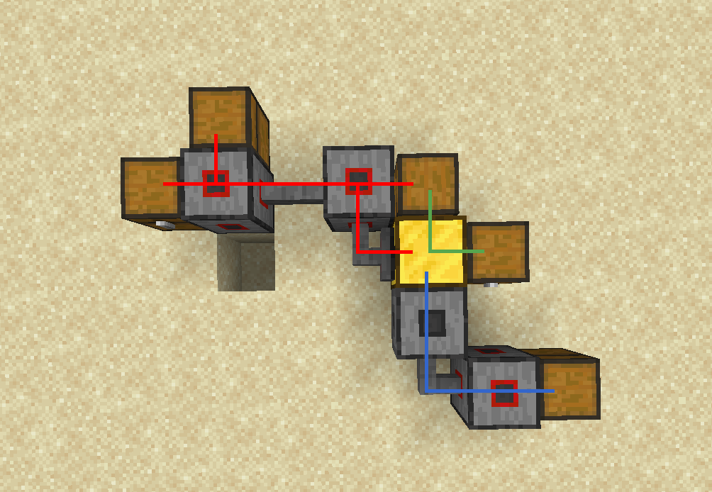

# ShrekWord and ShrekPrint
ShrekWord is a ComputerCraft "word"-like document editing program. It includes a nice menu bar, support for alignments, and text colors. It also includes built in support for printing to a printer running ShrekPrint over rednet.

## Installation
Download the latest versions of ShrekWord and ShrekPrint from the releases tab, or download via pinestore. See the ShrekPrint section for specifics on setting it up.

[![Download on PineStore](https://raster.shields.io/badge/dynamic/json?url=https%3A%2F%2Fpinestore.cc%2Fapi%2Fproject%2F114&query=%24.project.downloads&suffix=%20downloads&logo=data%3Aimage%2Fsvg%2Bxml%3Bbase64%2CPD94bWwgdmVyc2lvbj0iMS4wIiBlbmNvZGluZz0iVVRGLTgiPz4KPHN2ZyB3aWR0aD0iNzYuOTA0IiBoZWlnaHQ9Ijg5LjI5NSIgcHJlc2VydmVBc3BlY3RSYXRpbz0ieE1pZFlNaWQiIHZlcnNpb249IjEuMSIgdmlld0JveD0iMCAwIDc2OS4wNCA4OTIuOTUiIHhtbG5zPSJodHRwOi8vd3d3LnczLm9yZy8yMDAwL3N2ZyI%2BCiA8ZyB0cmFuc2Zvcm09InRyYW5zbGF0ZSgtMTQuNzQgLTQuNjgyNikiIGZpbGw9IiM5YWIyZjIiPgogIDxwYXRoIGQ9Im00MTAgODUxYzAtMTIgMjYtMjEgNTgtMjEgMTUgMCAyMiA0IDE3IDktMTQgMTItNzUgMjItNzUgMTJ6Ii8%2BCiAgPHBhdGggZD0ibTU4NSA3NDJjLTEtNDkgNC03MiAxNi04NSAyMi0yNCAzMC02OCAxNi04Ni0xMi0xNC0yNy0zOS00OC03OC0xMC0xOS05LTI2IDQtNDEgMjItMjQgMjEtNjctMi0xNDQtMjEtNjktMzktMTQ0LTQ4LTE5NS00LTI2LTItMzMgMTEtMzMgMzEgMCAxMTIgMzMgMTQxIDU4IDI4IDIzIDgxIDkyIDcxIDkyLTIgMCA1IDI2IDE2IDU3IDI4IDc5IDI5IDIyNCAzIDMwOC0xMCAzMy0xOSA2Mi0xOSA2NS00IDI2LTEzMiAxNTAtMTU1IDE1MC0zIDAtNi0zMC02LTY4eiIvPgogIDxwYXRoIGQ9Im02OCA2NzNjLTcyLTEwOS03MS0yNzggMy00MjMgMzYtNzEgNjItMTAwIDEyOC0xNDAgNDMtMjcgNjUtMzQgMTE4LTM2IDEwMC00IDk4IDExLTE5IDEzNi0zNCAzNy03OCA4OC05NiAxMTMtMjggMzktMzEgNDgtMjEgNjUgMTEgMTcgNiAyNy0zMyA3OS00MCA1My00NCA2Mi0zMiA3OCAxNyAyMyAxOCA1NyAyIDczLTYgNi0xNCAzMS0xNyA1NC02IDQyLTYgNDItMzMgMXoiLz4KIDwvZz4KIDxnIHRyYW5zZm9ybT0idHJhbnNsYXRlKC0xNC43NCAtNC42ODI2KSIgZmlsbD0iIzU5YTY0ZiI%2BCiAgPHBhdGggZD0ibTM2NSA4MTNjLTUzLTYtMTM5LTMzLTE5Mi02MS02OC0zNS04My02Ny01OC0xMjIgMjYtNTkgNDAtNjcgNzgtNDkgNjggMzMgMTY3IDU4IDI2NiA2OSA1OCA1IDEwNiAxMiAxMDkgMTQgMiAzIDYgMzIgOSA2NSA4IDg1IDAgOTEtMTAxIDkwLTQ0LTEtOTQtNC0xMTEtNnoiLz4KICA8cGF0aCBkPSJtNDEwIDQ1OWMtNjctNy0xNjAtMjktMTk5LTQ4LTI3LTE0LTM0LTM2LTIwLTYzIDIxLTM4IDk3LTEzNiAxNTAtMTkzIDI1LTI3IDU4LTcxIDczLTk3IDI1LTQzIDMxLTQ3IDU0LTQyIDQwIDEwIDQyIDEyIDQyIDUyIDAgMjAgNiA1NyAxNCA4MiAyNCA3MyA1NCAxOTIgNjIgMjM2IDUgMzUgMyA0NS0xNSA2My0yMyAyMy0zNiAyNC0xNjEgMTB6Ii8%2BCiA8L2c%2BCiA8ZyB0cmFuc2Zvcm09InRyYW5zbGF0ZSgtMTQuNzQgLTQuNjgyNikiIGZpbGw9IiM3ZWNiMjUiPgogIDxwYXRoIGQ9Im01NTggNjc0Yy0yLTItNTEtOS0xMDktMTQtMTAyLTExLTIwNC0zNy0yNjQtNjktMTYtOC0zMi0xNC0zNC0xMi00IDMtMzEtNDgtMzEtNjEgMC01IDIxLTMxIDQ2LTU4IDUxLTU0IDcxLTYwIDEzMC0zNSAxOSA4IDgzIDE5IDE0MiAyNSA1OCA2IDEwNyAxMiAxMDcgMTNzMTUgMjYgMzMgNTZjMjcgNDMgMzIgNjMgMzAgOTktMiAzNS04IDQ3LTI1IDUzLTExIDQtMjMgNi0yNSAzeiIvPgogPC9nPgogPGcgdHJhbnNmb3JtPSJ0cmFuc2xhdGUoLTE0Ljc0IC00LjY4MjYpIiBmaWxsPSIjZWNlZGVmIj4KICA8cGF0aCBkPSJtMjYwIDg5MGMtMzQtOC03MC00MS03MC02NSAwLTYtOS0yMC0yMC0zMHMtMjAtMjItMjAtMjctMTMtMjEtMzAtMzVjLTM1LTI5LTQxLTgzLTEzLTEyMiAxNS0yMiAxNS0yNi0xLTU2LTE4LTMzLTE4LTMzIDI3LTkxIDI4LTM2IDQyLTYzIDM2LTY4LTIzLTI1IDktNzggMTIwLTE5NyAzNi0zOCA3Mi04MSA4Mi05NiAxMC0xNCAyNS0zMCAzMy0zNSAzNi0yMCA3IDMyLTUzIDk3LTQ4IDUxLTEyNiAxNTAtMTQ5IDE4OS0xMCAxOC05IDI0IDEwIDQwIDIzIDE5IDIzIDE5LTI5IDcxLTUzIDUyLTUzIDUyLTM4IDgyIDE0IDI4IDE0IDMzLTEwIDc2LTMyIDU3LTIzIDgxIDQ2IDEyMCAzNCAxOSA0OSAzMyA0NSA0Mi0xNCAzNyAzNiA3NSA5OCA3NSAyNSAwIDQwLTcgNTQtMjUgMTgtMjMgMjctMjUgOTUtMjUgOTQgMCAxMDItOCA5My04OS02LTUzLTUtNTkgMTQtNjQgMzItOCAyNi02NC0xNS0xMzItMzUtNTgtMzUtNTgtOS04MiAyMS0xOSAyNC0yOSAxOS01Ni0xMC00Ny00NC0xNzUtNjEtMjI3LTgtMjUtMTQtNjItMTQtODMgMC0yNy01LTM5LTE3LTQzLTEwLTMtMjUtOC0zMy0xMC0xMi00LTEyLTYtMS0xNCAyNy0xNiA1NiA1IDY5IDUxIDM1IDExNyA0MyAxNDggNDYgMTcwIDIgMTMgMTEgNTEgMjEgODQgMjEgNzEgMjEgMTIxIDAgMTQ1LTE0IDE1LTEzIDE5IDUgNDMgMTEgMTQgMjAgMzAgMjAgMzVzNyAxNSAxNSAyMmMyMSAxNyAxNiA3NS0xMCAxMDItMTggMTktMjAgMzItMTcgNzkgNCA1MCAyIDU4LTE5IDcyLTEyIDktNTAgMTktODMgMjMtNDUgNS02NSAxMy04MyAzMi0yNiAyOC05MiAzOC0xNTMgMjJ6Ii8%2BCiA8L2c%2BCiA8ZyB0cmFuc2Zvcm09InRyYW5zbGF0ZSgtMTQuNzQgLTQuNjgyNikiIGZpbGw9IiM3ZTY3NGQiPgogIDxwYXRoIGQ9Im0yNDggODU0Yy0zMC0xNi00Ny01OS0zMC03NiA4LTggMjMtNyA1NCAyIDI0IDcgNjEgMTQgODMgMTcgNTQgNyA1OSAxNSAzNSA0Ni0xOCAyMy0yOSAyNy02OCAyNy0yNi0xLTU5LTctNzQtMTZ6Ii8%2BCiA8L2c%2BCjwvc3ZnPgo%3D&label=PineStore)](https://pinestore.cc/projects/114/shrekword) [![Download on PineStore](https://raster.shields.io/badge/dynamic/json?url=https%3A%2F%2Fpinestore.cc%2Fapi%2Fproject%2F115&query=%24.project.downloads&suffix=%20downloads&logo=data%3Aimage%2Fsvg%2Bxml%3Bbase64%2CPD94bWwgdmVyc2lvbj0iMS4wIiBlbmNvZGluZz0iVVRGLTgiPz4KPHN2ZyB3aWR0aD0iNzYuOTA0IiBoZWlnaHQ9Ijg5LjI5NSIgcHJlc2VydmVBc3BlY3RSYXRpbz0ieE1pZFlNaWQiIHZlcnNpb249IjEuMSIgdmlld0JveD0iMCAwIDc2OS4wNCA4OTIuOTUiIHhtbG5zPSJodHRwOi8vd3d3LnczLm9yZy8yMDAwL3N2ZyI%2BCiA8ZyB0cmFuc2Zvcm09InRyYW5zbGF0ZSgtMTQuNzQgLTQuNjgyNikiIGZpbGw9IiM5YWIyZjIiPgogIDxwYXRoIGQ9Im00MTAgODUxYzAtMTIgMjYtMjEgNTgtMjEgMTUgMCAyMiA0IDE3IDktMTQgMTItNzUgMjItNzUgMTJ6Ii8%2BCiAgPHBhdGggZD0ibTU4NSA3NDJjLTEtNDkgNC03MiAxNi04NSAyMi0yNCAzMC02OCAxNi04Ni0xMi0xNC0yNy0zOS00OC03OC0xMC0xOS05LTI2IDQtNDEgMjItMjQgMjEtNjctMi0xNDQtMjEtNjktMzktMTQ0LTQ4LTE5NS00LTI2LTItMzMgMTEtMzMgMzEgMCAxMTIgMzMgMTQxIDU4IDI4IDIzIDgxIDkyIDcxIDkyLTIgMCA1IDI2IDE2IDU3IDI4IDc5IDI5IDIyNCAzIDMwOC0xMCAzMy0xOSA2Mi0xOSA2NS00IDI2LTEzMiAxNTAtMTU1IDE1MC0zIDAtNi0zMC02LTY4eiIvPgogIDxwYXRoIGQ9Im02OCA2NzNjLTcyLTEwOS03MS0yNzggMy00MjMgMzYtNzEgNjItMTAwIDEyOC0xNDAgNDMtMjcgNjUtMzQgMTE4LTM2IDEwMC00IDk4IDExLTE5IDEzNi0zNCAzNy03OCA4OC05NiAxMTMtMjggMzktMzEgNDgtMjEgNjUgMTEgMTcgNiAyNy0zMyA3OS00MCA1My00NCA2Mi0zMiA3OCAxNyAyMyAxOCA1NyAyIDczLTYgNi0xNCAzMS0xNyA1NC02IDQyLTYgNDItMzMgMXoiLz4KIDwvZz4KIDxnIHRyYW5zZm9ybT0idHJhbnNsYXRlKC0xNC43NCAtNC42ODI2KSIgZmlsbD0iIzU5YTY0ZiI%2BCiAgPHBhdGggZD0ibTM2NSA4MTNjLTUzLTYtMTM5LTMzLTE5Mi02MS02OC0zNS04My02Ny01OC0xMjIgMjYtNTkgNDAtNjcgNzgtNDkgNjggMzMgMTY3IDU4IDI2NiA2OSA1OCA1IDEwNiAxMiAxMDkgMTQgMiAzIDYgMzIgOSA2NSA4IDg1IDAgOTEtMTAxIDkwLTQ0LTEtOTQtNC0xMTEtNnoiLz4KICA8cGF0aCBkPSJtNDEwIDQ1OWMtNjctNy0xNjAtMjktMTk5LTQ4LTI3LTE0LTM0LTM2LTIwLTYzIDIxLTM4IDk3LTEzNiAxNTAtMTkzIDI1LTI3IDU4LTcxIDczLTk3IDI1LTQzIDMxLTQ3IDU0LTQyIDQwIDEwIDQyIDEyIDQyIDUyIDAgMjAgNiA1NyAxNCA4MiAyNCA3MyA1NCAxOTIgNjIgMjM2IDUgMzUgMyA0NS0xNSA2My0yMyAyMy0zNiAyNC0xNjEgMTB6Ii8%2BCiA8L2c%2BCiA8ZyB0cmFuc2Zvcm09InRyYW5zbGF0ZSgtMTQuNzQgLTQuNjgyNikiIGZpbGw9IiM3ZWNiMjUiPgogIDxwYXRoIGQ9Im01NTggNjc0Yy0yLTItNTEtOS0xMDktMTQtMTAyLTExLTIwNC0zNy0yNjQtNjktMTYtOC0zMi0xNC0zNC0xMi00IDMtMzEtNDgtMzEtNjEgMC01IDIxLTMxIDQ2LTU4IDUxLTU0IDcxLTYwIDEzMC0zNSAxOSA4IDgzIDE5IDE0MiAyNSA1OCA2IDEwNyAxMiAxMDcgMTNzMTUgMjYgMzMgNTZjMjcgNDMgMzIgNjMgMzAgOTktMiAzNS04IDQ3LTI1IDUzLTExIDQtMjMgNi0yNSAzeiIvPgogPC9nPgogPGcgdHJhbnNmb3JtPSJ0cmFuc2xhdGUoLTE0Ljc0IC00LjY4MjYpIiBmaWxsPSIjZWNlZGVmIj4KICA8cGF0aCBkPSJtMjYwIDg5MGMtMzQtOC03MC00MS03MC02NSAwLTYtOS0yMC0yMC0zMHMtMjAtMjItMjAtMjctMTMtMjEtMzAtMzVjLTM1LTI5LTQxLTgzLTEzLTEyMiAxNS0yMiAxNS0yNi0xLTU2LTE4LTMzLTE4LTMzIDI3LTkxIDI4LTM2IDQyLTYzIDM2LTY4LTIzLTI1IDktNzggMTIwLTE5NyAzNi0zOCA3Mi04MSA4Mi05NiAxMC0xNCAyNS0zMCAzMy0zNSAzNi0yMCA3IDMyLTUzIDk3LTQ4IDUxLTEyNiAxNTAtMTQ5IDE4OS0xMCAxOC05IDI0IDEwIDQwIDIzIDE5IDIzIDE5LTI5IDcxLTUzIDUyLTUzIDUyLTM4IDgyIDE0IDI4IDE0IDMzLTEwIDc2LTMyIDU3LTIzIDgxIDQ2IDEyMCAzNCAxOSA0OSAzMyA0NSA0Mi0xNCAzNyAzNiA3NSA5OCA3NSAyNSAwIDQwLTcgNTQtMjUgMTgtMjMgMjctMjUgOTUtMjUgOTQgMCAxMDItOCA5My04OS02LTUzLTUtNTkgMTQtNjQgMzItOCAyNi02NC0xNS0xMzItMzUtNTgtMzUtNTgtOS04MiAyMS0xOSAyNC0yOSAxOS01Ni0xMC00Ny00NC0xNzUtNjEtMjI3LTgtMjUtMTQtNjItMTQtODMgMC0yNy01LTM5LTE3LTQzLTEwLTMtMjUtOC0zMy0xMC0xMi00LTEyLTYtMS0xNCAyNy0xNiA1NiA1IDY5IDUxIDM1IDExNyA0MyAxNDggNDYgMTcwIDIgMTMgMTEgNTEgMjEgODQgMjEgNzEgMjEgMTIxIDAgMTQ1LTE0IDE1LTEzIDE5IDUgNDMgMTEgMTQgMjAgMzAgMjAgMzVzNyAxNSAxNSAyMmMyMSAxNyAxNiA3NS0xMCAxMDItMTggMTktMjAgMzItMTcgNzkgNCA1MCAyIDU4LTE5IDcyLTEyIDktNTAgMTktODMgMjMtNDUgNS02NSAxMy04MyAzMi0yNiAyOC05MiAzOC0xNTMgMjJ6Ii8%2BCiA8L2c%2BCiA8ZyB0cmFuc2Zvcm09InRyYW5zbGF0ZSgtMTQuNzQgLTQuNjgyNikiIGZpbGw9IiM3ZTY3NGQiPgogIDxwYXRoIGQ9Im0yNDggODU0Yy0zMC0xNi00Ny01OS0zMC03NiA4LTggMjMtNyA1NCAyIDI0IDcgNjEgMTQgODMgMTcgNTQgNyA1OSAxNSAzNSA0Ni0xOCAyMy0yOSAyNy02OCAyNy0yNi0xLTU5LTctNzQtMTZ6Ii8%2BCiA8L2c%2BCjwvc3ZnPgo%3D&label=PineStore)](https://pinestore.cc/projects/115/shrekprint)

## ShrekPrint Setup
ShrekPrint is my high speed 16 color printing software designed for use with my ShrekDoc format. Install it on an advanced crafty turtle connected to a network with (at least 3) chests and (at least 1) printer(s).

When running it for the first time you will be prompted for various things.
* The hostname is whatever you want the printer to identify as on rednet.
* The rednet modem should be the modem you want to host the rednet print server over, this can be a wireless or wired modem. Though keep in mind if you use a wireless modem *anybody* on the server can see and print to your printer.
* The workspace chests are chests to use for intermediate storage of documents while they're being printed.
* The stockpile chests are, well, a stockpile of resources like ink and paper.
* The output is a single inventory which finished documents (and scraps when the printer is emptied) will be deposited into.

Do NOT use the same inventory for multiple categories. All inventories and printers MUST be on the same wired network. Here's an exmaple of how networks are determined:


Attach as many printers as you'd like, and optionally additional crafty turtles running `spcrafter.lua`.

### ShrekPrint Settings
After you go through the first time setup your configurations are saved to various files. The inventory lists are stored in `output.chests`, `stockpile.chests`, and `workspace.chests`. Keep in mind that the OUTPUT inventory can ONLY be ONE inventory, it cannot be a cluster like the others.

Your hostname and rednet modem configurations are saved using the CC `settings` API. They are `sprint.hostname` and `sprint.modem` respectively. 

## ShrekDoc
ShrekDoc is a new ComputerCraft document format that I have created. A document is any string with a header of the format `shrekdoc-v01w00h00mR:`, where there are three 2 digit numbers representing the version (v), width (w), and height (h) of the document. There is also `mR` or `mS`, which represents "raw mode" and "serialized mode" for the document. In raw mode the data is interpreted as is, but in serialized mode anything following the header is passed into `textutils.unserialize` before decoding. This is useful for using lua escape sequences for the control character (`shrekdoc-v01w25h21mS"Hello \160caWorld!\160r"`), but any documents saved using ShrekWord will be saved in raw mode.

# Mbar
Mbar is a library I have written to make simple menu bars for programs. Use any program on a modern operating system, and somewhere it has a menu bar (might be hidden in some web browser based applications), this is a recreation of those.

To make use of the library download it (`libs/mbar.lua`) and place it into your computer directory. Here is an example program:

```lua
local mbar = require("mbar")

local win = window.create(term.current(), 1, 1, term.getSize())
-- before using you must set the window for mbar to draw to
mbar.setWindow(win)

local running = true
local openButton = mbar.button("Open", function(entry)
    -- do stuff
end)
local quitButton = mbar.button("Quit", function(entry)
    running = false
end)
local fileMenu = mbar.buttonMenu {
    openButton,
    quitButton
}
local fileButton = mbar.button("File", nil, fileMenu)

local aboutButton = mbar.button("About", function(entry)
    -- you get it by now
end)

local bar = mbar.bar {
    fileButton,
    aboutButton
}
-- setup control + q to quit
bar.shortcut(quitButton, keys.q, true)

while running do
    win.setVisible(false)
    win.clear()
    bar.render()
    win.setVisible(true)
    local e = { os.pullEvent() }
    if not bar.onEvent(e) then
        -- this returns true when the event is consumed
        -- so via negating it you can take action for
        -- any clicks / etc that are not consumed by the bar and menus
    end
end
```